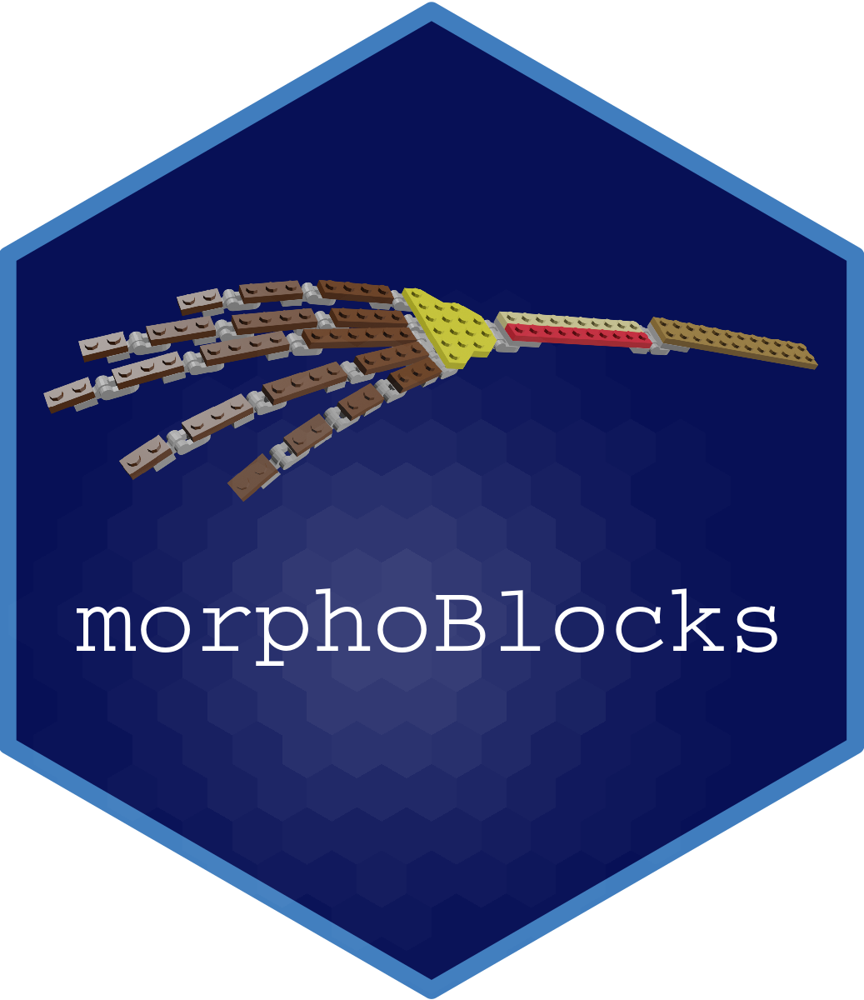
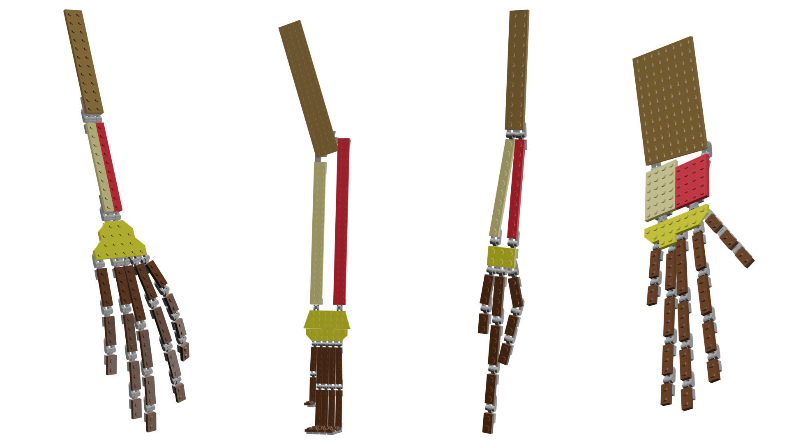

# morphoBlocks 

<!-- badges: start -->

[](https://github.com/aharmer/morphoBlocks/actions)
[](https://www.repostatus.org/#active)
[](https://github.com/aharmer/morphoBlocks)
[](https://www.gnu.org/licenses/gpl-3.0.en.html)
<!-- badges: end -->

Overview 
--------

<br /> 
<br /> 

The `morphoBlocks` package provides a workflow for constructing a multiple-part morphospace with Regularized Consensus Principal Component Analysis (RCPCA) using either traditional landmarks or pseudolandmarks.  
<br /> 
The `analyseBlocks` function is applied to an object of class "blockList" produced by the `combineBlocks` function and has two options: 1) `option = "rcpca"` and 2) `option = "pca"`. The `option = "rcpca"` will perform Regularized Consensus Principal Component Analysis using the `rgcca` function from the RGCCA package (Tenenhaus and Guillemot 2017), and is the default option for `analyseBlocks`. The `rgcca` function itself has many options that each perform a different type of analysis. The `analyseBlocks` function specifically calls the Regularized Consensus Principal Component Analysis in mode 2 option with scaling applied. For further detail see Tenenhaus and Guillemot (2017) and Tenenhaus et al. (2017). The `option = "pca"` will perform principal component analysis on the superblock item in the block list using the `prcomp` function from the `stats` package in R.

<br />  



<br />  


Updates
-------

This is the original release of the package.


Installation
------------

You can install `morphoBlocks` directly within R using the `install_github()` function from the [`devtools`](https://cran.r-project.org/web/packages/devtools/index.html) package:

To install with vignettes:
``` r
devtools::install_github("aharmer/morphoBlocks", build_vignettes = TRUE, dependencies = TRUE)
```

OR if you do not wish to install the vignettes:
``` r
devtools::install_github("aharmer/morphoBlocks")
```

**Note:** If you are using RStudio, the above installation methods should work without issue as RStudio is bundled with Pandoc. However, if you are using the R native GUI, you will need to have [Pandoc](https://pandoc.org/) installed if you wish to build the vignettes.

Depending on your setup, you may also need to install Rtools first. If you need Rtools you will get an error message during `morphoBlocks` installation. Just install Rtools then reinstall `morphoBlocks`.


How to use morphoBlocks
---------------------

Detailed usage examples of `morphoBlocks` can be retrieved using the `vignette` function.

For example usage with real world data:

``` r
vignette("penguinWings")
```

Or to compare the performance of Regularized Consensus Principal Component Analysis (RCPCA) with traditional principal components analysis (PCA):

``` r
vignette("morphoBlocksMethods")
```

Or to compare how long analyses will take given increasingly large datasaets, in a particular computational environment (e.g. a local machine):

```r
vignette("datasetSize")
```


Planned improvements
---------------------

* Unit testing
* Add ... argument to scoresPlot and loadingsPlot to allow additional plotting customisation
*	Replace block identification by letters with block identification by numbers in `combineBlocks`
*	Add more comments to function examples
*	Add functionality for showing warps


How to cite
---------------------

References
----------

Tenenhaus A, Guillemot V. 2017. RGCCA: Regularized and Sparse Generalized Canonical Correlation Analysis for multiblock data 2.1.2. https://CRAN.R-project.org/package=RGCCA. 

Tenenhaus M, Tenenhaus A, Groenen PJF. 2017. Regularized Generalized Canonical Correlation Analysis: A framework for sequential multiblock component methods. Psychometrika 82: 737-777 https://doi.org/10.1007/s11336-017-9573-x

<br /> 
<br /> 
<br /> 
