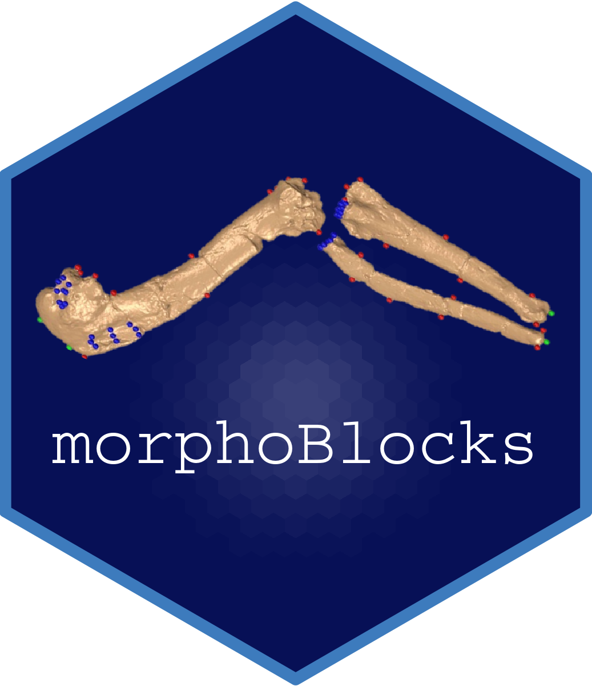

Overview 
--------

The `morphoBlocks` package provides a workflow for constructing a multiple-part morphospace with regularised consensus principal component analysis (RCPCA) using either traditional landmarks or pseudolandmarks.

<br />  


<br />  


Updates
-------

This is the original release of the package.


Installation
------------

#### morphoBlocks

You can install `morphoBlocks` directly within *R* using the `install_github()` function from the [`devtools`](https://www.rstudio.com/products/rpackages/devtools/) package:

``` r
install_github("aharmer/morphoBlocks", build_vignettes = TRUE)
```

Depending on your setup, you may also need to install *Rtools* first. If you need *Rtools* you will get an error message during `morphoBlocks` installation. Just install *Rtools* then reinstall `morphoBlocks`.


How to use morphoBlocks
---------------------

Detailed usage examples of `morphoBlocks` can be retrieved using the `vignette` function.

For example usage with real world data:

``` r
vignette("pengiunWings")
```

Or to compare the performance of regularised consensus principal component analysis (RCPCA) with traditional principal components analysis (PCA):

``` r
vignette("morphoBlocksMethods")
```

How to cite
---------------------
<br /> 
<br /> 
<br /> 
