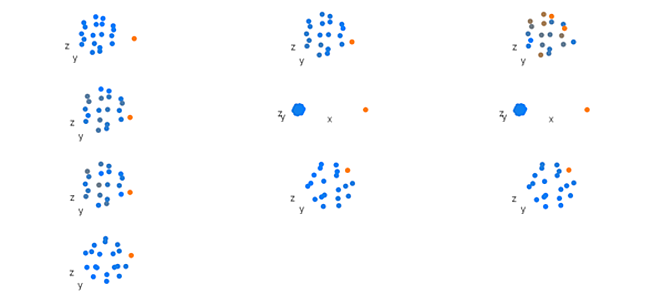
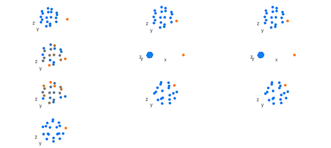

```{r setup, include = FALSE}
knitr::opts_chunk$set(
  collapse = TRUE,
  comment = "#>",
  tidy.opts = list(width.cutoff = 100),
  tidy = TRUE
)
library(kableExtra)
```

&nbsp;

Overview
--------
An example comparing the results of the PCA and RCPCA analysis options in the `analyeBlocks` function. The `pca` option scales and combines data blocks into a superblock so that samples no longer retain the multi-part structure, and then applies principal component analysis. The `rcpca` option retains the multi-part structure, and also uses the scaled and combined superblock, and then applies Regularized Consensus Principal Component Analysis. This example uses the `dodecBlock` function to simulate data blocks of shape configurations with known variation and a small amount of random noise.

&nbsp;

Model dataset
--------

A dataset of ten multiple-part samples is constructed using `dodecBlock`.

``` {r warnings = FALSE, message = FALSE}
library(morphoBlocks)

# Generate data blocks for the n = 10 samples in this example
set.seed(1)
block1 <- dodecBlock(n = 10, vertex_shift = c(10, 6, 1, 1, 1, 1, 1, 1, 1, 1))
block2 <- dodecBlock(n = 10, vertex_shift = c(1, 1.25, 1, 1, 1, 1, 1.25, 1.25, 1.25, 1.25))
block3 <- dodecBlock(n = 10, vertex_shift = c(1.25, 1, 1.25, 1.25, 1.25, 1.25, 1, 1, 1, 1))
block4 <- dodecBlock(n = 10, vertex_shift = c(1, 1, 1, 1, 1, 1, 1, 1, 1, 1))
block5 <- dodecBlock(n = 10, vertex_shift = c(25, 25, 25, 25, 25, 25, 25, 25, 25, 25))
block6 <- dodecBlock(n = 10, vertex_shift = c(25, 25, 25, 25, 25, 25, 25, 25, 25, 25))
block7 <- dodecBlock(n = 10, vertex_shift = c(1, 1, 1, 1, 1, 1, 1, 1, 1, 1))
block8 <- dodecBlock(n = 10, vertex_shift = c(-1.25, 1, -1.25, -1.25, -1.25, -1.25, 1, 1, 1, 1))
block9 <- dodecBlock(n = 10, vertex_shift = c(1, -1.25, 1, 1, 1, 1, -1.25, -1.25, -1.25, -1.25))
block10 <- dodecBlock(n = 10, vertex_shift = c(-8, -4, 1, 1, 1, 1, 1, 1, 1, 1))
```


&nbsp;

Each sample in the dataset is comprised of ten dodecahedra. Here, we treat the Cartesian coordinates of the 20 vertices in each dodecahedron as three-dimensional landmark coordinates. The first dodecahedron in each sample together constitutes data block one (i.e. data block one is present in all samples). Likewise, dodecahedron two in each sample constitutes data block two, and so on for all ten dodecahedra in each sample. To visualise a sample, picture a vertebral column made up of ten vertebrae numbered in descending order where landmarks from each vertebra form a dodecahedron. The complete model dataset therefore represents ten such vertebral columns. The ten dodecahedra in each sample all have similar *x* and *y* coordinates. Variation is introduced to the dataset by adjusting the *z* coordinate of the first landmark in each dodecahedron by a pre-determined value (Table 1). To continue the visual analogy, consider each vertebra as having a dorsally-projecting spine; the heights of the spines are determined by the *z* coordinate value.

&nbsp;
&nbsp;

``` {r echo = FALSE}
table_1 <- read.csv(system.file("extdata", "z_vertex_shift.csv", package = "morphoBlocks"), colClasses = "numeric")
table_1$Sample <- as.factor(table_1$Sample)

knitr::kable(table_1, caption = "Table 1. Values added to the *z* coordinate of the first vertex in the corresponding dodecahedron for each subset within each sample of the model dataset.", col.names = gsub("[.]", " ", names(table_1)), align = "c", format.args = list(nsmall = 2)) %>%
  kableExtra::kable_classic(full_width = FALSE) %>%
  kableExtra::row_spec(0, bold = TRUE)
```

&nbsp;
&nbsp;

Data blocks are scaled (normalised centroid size method; Collyer et al., 2020) and combined into a block list using `combineBlocks`. A column-wise concatenation of each data block is added as a superblock to the list produced by `combineBlocks`.

``` {r}
# Combine data blocks into a single block list
block.list <- combineBlocks(blocks = c(
  block1, block2, block3, block4, block5, block6,
  block7, block8, block9, block10
))
```

&nbsp;

Here, we are using the *z* coordinate adjustment values to add three components of variation to the model dataset: 1) substantial differences between samples one and two when compared with all other samples; 2) fewer differences between samples three to six, and again between samples seven to ten, when compared with other samples; 3) fewer differences between sample two and samples seven to ten, and likewise between sample one and samples three to six (Table 2). A trivial amount of random noise is added to each vertex so that the landmark configurations of one sample are not identical to any other sample.

&nbsp;
&nbsp;

``` {r echo = FALSE}
table_2 <- read.csv(system.file("extdata", "cor_matrix.csv", package = "morphoBlocks"))
names(table_2)[1] <- ""

knitr::kable(table_2, caption = "Table 2. Correlation between multi-part samples after the data blocks in each sample were Procrustes-transformed and scaled with the normalised centroid size method described by Collyer et al. (2020).", col.names = gsub("[.]", " ", colnames(table_2)), align = "c", digits = 3) %>%
  kableExtra::kable_classic(full_width = TRUE) %>%
  kableExtra::row_spec(0, bold = TRUE) %>%
  kableExtra::column_spec(1, bold = TRUE) %>%
  kableExtra::column_spec(2, color = "black", background = ifelse(table_2[, 2] == 1, "#A0DFAF", ifelse(table_2[, 2] == 0.998, "#99DBBB", ifelse(table_2[, 2] >= 0.985, "#8FC7C6", "#A17FA9")))) %>%
  kableExtra::column_spec(3, color = "black", background = ifelse(table_2[, 3] == 1, "#A0DFAF", ifelse(table_2[, 3] == 0.998, "#99DBBB", ifelse(table_2[, 3] >= 0.985, "#8FC7C6", "#A17FA9")))) %>%
  kableExtra::column_spec(4, color = "black", background = ifelse(table_2[, 4] == 1, "#A0DFAF", ifelse(table_2[, 4] == 0.998, "#99DBBB", ifelse(table_2[, 4] >= 0.985, "#8FC7C6", "#A17FA9")))) %>%
  kableExtra::column_spec(5, color = "black", background = ifelse(table_2[, 5] == 1, "#A0DFAF", ifelse(table_2[, 5] == 0.998, "#99DBBB", ifelse(table_2[, 5] >= 0.985, "#8FC7C6", "#A17FA9")))) %>%
  kableExtra::column_spec(6, color = "black", background = ifelse(table_2[, 6] == 1, "#A0DFAF", ifelse(table_2[, 6] == 0.998, "#99DBBB", ifelse(table_2[, 6] >= 0.985, "#8FC7C6", "#A17FA9")))) %>%
  kableExtra::column_spec(7, color = "black", background = ifelse(table_2[, 7] == 1, "#A0DFAF", ifelse(table_2[, 7] == 0.998, "#99DBBB", ifelse(table_2[, 7] >= 0.985, "#8FC7C6", "#A17FA9")))) %>%
  kableExtra::column_spec(8, color = "black", background = ifelse(table_2[, 8] == 1, "#A0DFAF", ifelse(table_2[, 8] == 0.998, "#99DBBB", ifelse(table_2[, 8] >= 0.985, "#8FC7C6", "#A17FA9")))) %>%
  kableExtra::column_spec(9, color = "black", background = ifelse(table_2[, 9] == 1, "#A0DFAF", ifelse(table_2[, 9] == 0.998, "#99DBBB", ifelse(table_2[, 9] >= 0.985, "#8FC7C6", "#A17FA9")))) %>%
  kableExtra::column_spec(10, color = "black", background = ifelse(table_2[, 10] == 1, "#A0DFAF", ifelse(table_2[, 10] == 0.998, "#99DBBB", ifelse(table_2[, 10] >= 0.985, "#8FC7C6", "#A17FA9")))) %>%
  kableExtra::column_spec(11, color = "black", background = ifelse(table_2[, 11] == 1, "#A0DFAF", ifelse(table_2[, 11] == 0.998, "#99DBBB", ifelse(table_2[, 11] >= 0.985, "#8FC7C6", "#A17FA9"))))
```

&nbsp;
&nbsp;

Principal component analysis of combined dataset
--------

Principal component analysis is performed on the superblock from the block list using `analyseBlocks` with `option = "pca"`, which calls `prcomp` from the base `stats` package. 

``` {r}
# Analyse block list with principal component analysis
result.pca <- analyseBlocks(block.list, option = "pca")
```

&nbsp;

The proportion of variation explained by the first three principal components is 0.87, 0.12 and 0.01 respectively. 

``` {r}
# Generate explained variance values
(round(result.pca$result$sdev^2 / (sum(result.pca$result$sdev^2)), 3))
```

&nbsp;

Both principal component one (PC1) and principal component two (PC2) describe the *Z* adjustment values applied to the first vertex in each dodecahedron (Figures 1 & 2). The distribution of scores along PC1 and PC2 (Figure 3) reflect the correlations described in Table 2.

``` {r eval = FALSE}
# Figure 1
loadingsPlot(result.pca, comp = 1, cex.3d = 10)

# Figure 2
loadingsPlot(result.pca, comp = 2, cex.3d = 10)
```


Figure 1. Component one loadings from a principal component analysis of simulated shape data. Beginning top left and reading right and down, each group of shows mean position of landmarks in each data block. Orange represents points that have larger loadings and blue represents points that have smaller loadings.

&nbsp;


Figure 2. Component two loadings from a principal component analysis of simulated hape data. See Figure 1 for key.

&nbsp;

``` {r fig.align = "center", out.width = "90%", fig.height = 4, fig.cap = "Figure 3. Principal component one (PC1) and PC2 score values (left), and PC2 and PC3 score values (right), for the dataset comprised of ten blocks that were scaled, transformed and combined. Samples numbers shown with labels."}
# Figure 3
par(mfrow = c(1, 2))
scoresPlot(result.pca, comp = c(1, 2), plabels = 1:10)
scoresPlot(result.pca, comp = c(2, 3), plabels = 1:10)
```

&nbsp;

Regularized Consensus Principal Component Analysis of scaled dataset
--------

Regularized Consensus Principal Component Analysis (mode 2) is performed on the block list using `analyseBlocks` with `option = "rcpca"`, which calls `rgcca` from the Regularized Generalized Canonical Correlation Analysis package (`RGCCA`, Tenenhaus and Guillemot, 2017). 

``` {r}
# Analyse block list
result.rcpca <- analyseBlocks(block.list, option = "rcpca", ncomp = 20)
```

&nbsp;

The proportion of variancein the dataset explained by a component calculated with RCPCA is presented as an average explained variance value, and is related to explained variance from PCA but is not identical (Tenenhaus and Guillemot, 2017). The proportion for variance in the dataset explained by the first three global components (GCs) from the RCPCA are 0.71, 0.17 and 0.03.

``` {r}
# Average variance explained for the consensus space of the RCPCA
result.rcpca$result$AVE[[1]][[11]]
```

Note that the consensus space for CPCA also presents additional components of variation beyond the number expected from PCA. These additional components each describe different sources and amounts of variation in the dataset. For example, the proportion of variation that global components nine, ten and eleven explain is 0.12, 0.41 and 0.67, respectively. These additional global components provide different explanations of the variation in the dataset.

|     Global components one (GC1) and two (GC2) from the consensus space give contrasting loadings between the first vertex in the dodecahedra compared with most other vertices, especially for blocks five and six (Figures 4 & 5).

``` {r eval = FALSE}
# Figure 4
loadingsPlot(result.rcpca, comp = 1, cex.3d = 10)

# Figure 5
loadingsPlot(result.rcpca, comp = 2, cex.3d = 10)
```


Figure 4. Global component one loadings from a Regularized Consensus Principal Component Analysis of simulated shape data. See Figure 1 for key.

&nbsp;


Figure 5. Global component two loadings from a Regularized Consensus Principal Component Analysis of simulated shape data. See Figure 1 for key.

&nbsp;

Global component one distinguishes sample 1 and sample 2 from the remaining samples (i.e. largest source of variation in the dataset) (Figure 6). Global component two distinguishes samples three, four, five and six from samples seven, eight, nine and ten (i.e. second largest source of variation in the dataset), and also shows the similarity between sample one and samples three to six, and sample two and samples seven to ten (i.e. third largest source of variation in the dataset) (Figure 6). The clustered samples three to six, and seven to ten, are offset from one another along GC2, which indicates that the random noise is also being explained by this global component. Hence, the four sources of variation that were intentionally introduced into the dataset are explained by the first two global components of CPCA. The second global component of the CPCA consensus space also explains the random noise which was not explained by PC2 and was weakly explained by PC3 in the principal component analysis (Figure 3). In summary, GC1 and GC2 from CPCA integrate all of the variation in dataset.

``` {r fig.align = "center", out.width = "90%", fig.height = 4, fig.cap = "Figure 6. Global component one (GC1) and two (GC2) score values (left), and GC2 and GC3 score values (right), for the dataset comprised of ten blocks that were scaled, transformed and combined. Samples numbers shown with labels."}
# Figure 6
par(mfrow = c(1, 2))
scoresPlot(result.rcpca, comp = c(1, 2), plabels = 1:10, consensus.only = TRUE)
scoresPlot(result.rcpca, comp = c(2, 3), plabels = 1:10, consensus.only = TRUE)
```

&nbsp;

Conclusion
--------

Principal component analysis on scaled and combined data blocks (i.e. `analyseBlocks`, `option = "pca"`) and Regularized Consensus Principal Component Analysis on the list of data blocks (i.e. `analyseBlocks`, `option = "rcpca"`) produce similar score value distributions for the first two components. However, the weaker sources of variation in the PCA are dampened in PC1 and PC2, whereas these weaker sources of variation are observable alongside stronger sources of variation in the first two components of the RCPCA consensus space. Thus, CPCA is better able to explain variation in the dataset in the first few components when compared with PCA.

&nbsp;

References
--------
* Collyer, M. L., Davis, M. A., Adams, D. C. (2020). Making heads or tails of combined landmark configurations in geometric morphometric data. Evolutionary Biology, 47, 193-205. https://doi.org/10.1007/s11692-020-09503-z

* Tenenhaus, A., Guillemot, V. (2017). RGCCA: Regularized and Sparse Generalized Canonical Correlation Analysis for multiblock data 2.1.2. https://CRAN.R-project.org/package=RGCCA.

&nbsp;
&nbsp;
