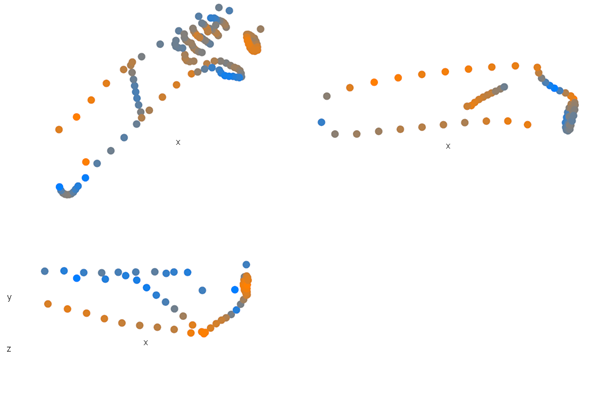

```{r setup, include = FALSE}
knitr::opts_chunk$set(
  collapse = TRUE,
  comment = "#>",
  tidy.opts = list(width.cutoff = 90),
  tidy = TRUE
)
library(kableExtra)
```

&nbsp;

Overview
--------
The multiple-part objects in this example are partial wing skeletons comprised of humerus, radius and ulna. These partial wing skeletons are from 15 extant species of penguin and five fossil species of penguin, which together constitute a dataset of 60 wing bones (Table 1). 

|    Shape data from the multiple-part objects are provided as landmark configurations. Three sets of landmarks were produced for each of the digital replicas so that the replicates could be averaged to mitigate effects of placement error. The nine sets of landmark configurations (i.e. three sets from each of the three bones) were separately read into `R` using `readPts` with `gpa = FALSE` (i.e. generalised Procrustes transformation not performed) and are available by calling `morphoBlocks`. The function `readPts` is a wrapper for the `read.pts` and `cSize` functions from `Morpho` (Schlager 2017). First, load the dataset:

``` {r warnings = FALSE, message = FALSE}
library(morphoBlocks)
data(penguinWings)
```

&nbsp;

The analysis in this example will use the mean values of the three replicate landmark configurations from each part. Creating these averaged values requires averaging the configurations stored in the @raw term of their respective block-class objects. 

``` {r}
# Extract and average the landmark configurations
hum_av = (hum1@raw + hum2@raw + hum3@raw)/3
rad_av = (rad1@raw + rad2@raw + rad3@raw)/3
uln_av = (uln1@raw + uln2@raw + uln3@raw)/3
```

&nbsp;  

Prepare data blocks for analysis
--------
Each set of averaged landmarks can now be formatted into a data block with the `formatBlock` function. Here, we will use the @curves term from one of the replicates, and will set `gpa = TRUE` to perform generalised Procrustes transformation on the landmark configurations. Generalised Procrustes transformation is performed using `gpagen` from `geomorph` (Adams & Otárola-Castillo, 2013), which is called by `formatBlock`. 

``` {r}
# Format the averaged landmark configurations into data blocks
block1 = formatBlock(hum_av, curves = hum1@curves, k = 3, gpa = TRUE)
block2 = formatBlock(rad_av, curves = rad1@curves, k = 3, gpa = TRUE)
block3 = formatBlock(uln_av, curves = uln1@curves, k = 3, gpa = TRUE)
```

&nbsp;

The three data blocks of Procrustes-transformed configurations (humerus, radius, ulna) are organised into a list of data blocks and scaled using the normalised weighted centroid size method from Collyer et al. (2020). 

``` {r}
# Scale and combine data blocks into a single list of blocks
blocklist = combineBlocks(blocks = c(block1, block2, block3))
```

&nbsp;

Analyse list of blocks
--------
The scaled data blocks are analysed with regularised consensus principal component analysis (RCPCA) in mode 2 using the `rgcca` function from `RGCCA` (Tenenhaus & Guillemot, 2017), which is called by `analyseBlocks` when `option = 'rcpca'`.

``` {r}
# Analyse the list of data blocks using RCPCA
result = analyseBlocks(blocklist, ncomp = 10)
```

&nbsp;

Plot results
--------
Use `scoresPlot` to show the consensus space from the analysis, which here represents a morphospace for the partial-wing skeleton.

``` {r fig.align = 'center'}
# Setup colour vector to show different ages of fossil penguins. Paleocene (brown), stem-lineage penguins from the Oligocene (light brown), and extant penguins (white).
pcol = c("#ffffff", "#ffffff", "#ffffff", "#ffffff", "#e6b481", "#ffffff", "#ffffff", "#ffffff", "#ffffff", "#ffffff", "#ffffff", "#ffffff", "#ffffff", "#ffffff", "#feebd3", "#feebd3", "#ffffff", "#e6b481", "#feebd3", "#ffffff")

# Plot consensus space showing global component one (GC1) and global component one (GC2) 
scoresPlot(result, pcol = pcol)
```

&nbsp;

Use `loadingsPlot` to show the loadings for global component one of the analysis. Global component loadings are visualised by colouring the mean position of each landmark in each block. Stronger orange colours represent landmarks with larger loadings (i.e. greater amounts of variation), and stronger blue colours represent landmarks with weaker loadings. Each data block is plotted as a separate panel.

``` {r eval = FALSE}
# Plot loadings for global component one (GC1)
loadingsPlot(result, cex.3d = 15)
```

<center>

</center>


&nbsp;
&nbsp;

Data sources
--------
``` {r echo = FALSE}
dat = read.csv(system.file("extdata", "penguin_bone_metadata.csv", package = "morphoBlocks"))

knitr::kable(dat, caption = "Table 1. 3D digital replicas produced from bones of modern and fossil penguins.") %>%
  column_spec(2:3, italic = TRUE) %>% 
  footnote("Institution abbreviations: CM, Canterbury Museum, Christchurch, New Zealand; NMNZ, Museum of New Zealand Te Papa Tongarewa, Wellington, New Zealand; OM, Otago Museum, Dunedin, New Zealand, New Zealand; UC, University of Canterbury, Christchurch, New Zealand (specimen held at OU, Geology Museum, University of Otago, Dunedin, New Zealand). Specimen ages from or compiled by Slack et al. (2006), Ksepka and Ando (2011), and Ksepka et al. (2012) and literature reviewed therein.", fixed_small_size = TRUE)
```

&nbsp;

References
--------
* D. C. & Otárola-Castillo, E. (2013). Geomorph: An R package for the collection and analysis of geometric morphometric shape data. Methods in Ecology and Evolution, 4, 393–399. https://doi.org/10.1111/2041-210x.12035

* Collyer, M. L., Davis, M. A. & Adams, D. C. (2020). Making heads or tails of combined landmark configurations in geometric morphometric data. Evolutionary Biology, 47, 193-205. https://doi.org/10.1007/s11692-020-09503-z

* Ksepka, D. T. & Ando, T. (2011). Penguins past, present, and future: Trends in the evolution of the Sphenisciformes. In G. Dyke & G. Kaiser (Ed.), Living  Dinosaurs: The Evolutionary History of Modern Birds, First Edition (pp. 155–186). John Wiley & Sons.

* Ksepka, D. T., Fordyce, R. E., Ando, T. & Jones, C. M. (2012). New fossil penguins (Aves, Sphenisciformes) from the Oligocene of New Zealand reveal the skeletal plan of stem penguins. Journal of Vertebrate Paleontology, 32, 235–254. https://doi.org/10.1080/02724634.2012.652051

* Schlager, S. (2017). Morpho and Rvcg – Shape Analysis in R. In G. Zheng, S. Li & G. Székely (Ed.), Statistical shape and deformation analysis (pp. 217-256). Academic Press.

* Slack, K. E., Jones, C. M., Ando, T., Harrison, G. L., Fordyce, R. E., Arnason, U. & Penny, D. (2006). Early penguin fossils, plus mitochondrial genomes, calibrate avian evolution. Molecular Biology and Evolution, 23, 1144–1155. https://doi.org/10.1093/molbev/msj124

* Tenenhaus, A. & Guillemot, V. (2017). RGCCA: Regularized and sparse generalized canonical correlation analysis for multiblock data 2.1.2. https://CRAN.R-project.org/package=RGCCA.

&nbsp;
&nbsp;

